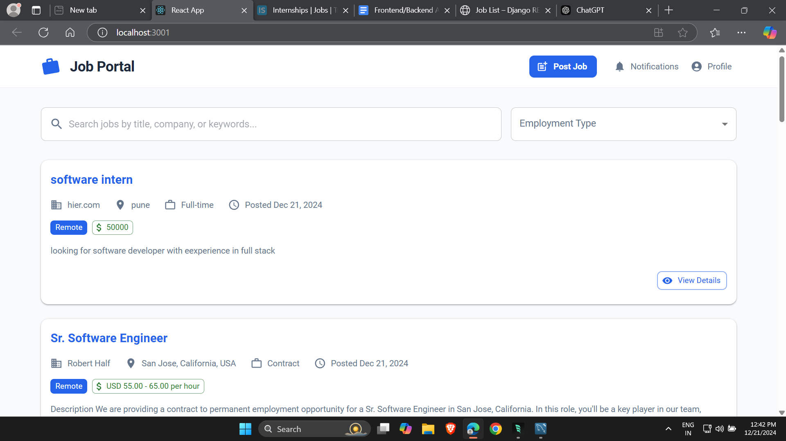
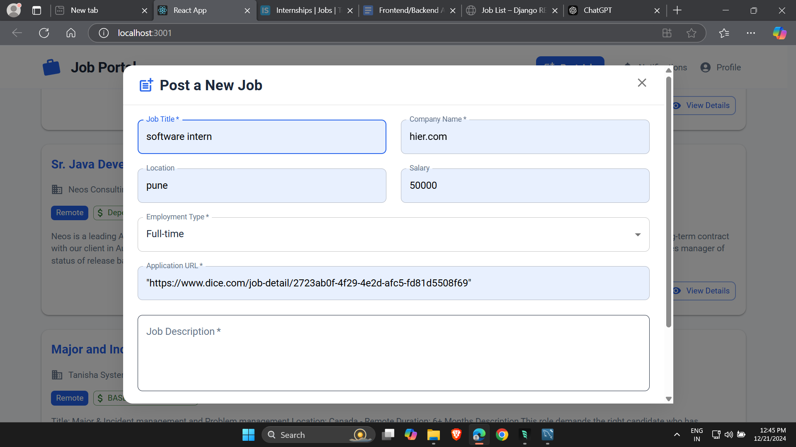

# Job Portal

A modern job portal built with React and Django, featuring a beautiful UI and powerful job search capabilities.

## Features


## Screenshots

### Home Page

*The main dashboard showing job listings*

### Job Details

*Detailed view of a job posting*

### Post Job

*Job posting form with validation*

## How to Add Screenshots

1. Take screenshots of your application:
   - Windows: Use `Windows + Shift + S` to take a screenshot
   - Mac: Use `Command + Shift + 4` to take a screenshot
   - Linux: Use `PrtScr` key or a tool like `Flameshot`

2. Save screenshots in the `screenshots` folder:
   ```
   job_portal/
   ├── screenshots/
   │   ├── home.png
   │   ├── job-details.png
   │   └── post-job.png
   ```

3. Reference screenshots in README.md using relative paths:
   ```markdown
   
   ```

## GitHub Upload Instructions

1. Initialize Git repository (if not already done):
   ```bash
   git init
   ```

2. Add files to Git:
   ```bash
   git add .
   ```

3. Commit changes:
   ```bash
   git commit -m "Add screenshots to README"
   ```

4. Create a new repository on GitHub:
   - Go to https://github.com/new
   - Name your repository
   - Keep it public
   - Don't initialize with README

5. Link and push to GitHub:
   ```bash
   git remote add origin https://github.com/yourusername/job-portal.git
   git branch -M main
   git push -u origin main
   ```

## Development Setup

1. Backend Setup:
   ```bash
   cd backend
   pip install -r requirements.txt
   python manage.py migrate
   python manage.py runserver
   ```

2. Frontend Setup:
   ```bash
   cd frontend
   npm install
   npm start
   ```

## Technologies Used

- Frontend:
  - React
  - Material-UI
  - Axios
  - React Router

- Backend:
  - Django
  - Django REST Framework
  - MySQL
  - CORS Headers

## Contributing

1. Fork the repository
2. Create your feature branch (`git checkout -b feature/AmazingFeature`)
3. Commit your changes (`git commit -m 'Add some AmazingFeature'`)
4. Push to the branch (`git push origin feature/AmazingFeature`)
5. Open a Pull Request

## License

This project is licensed under the MIT License - see the [LICENSE](LICENSE) file for details.
